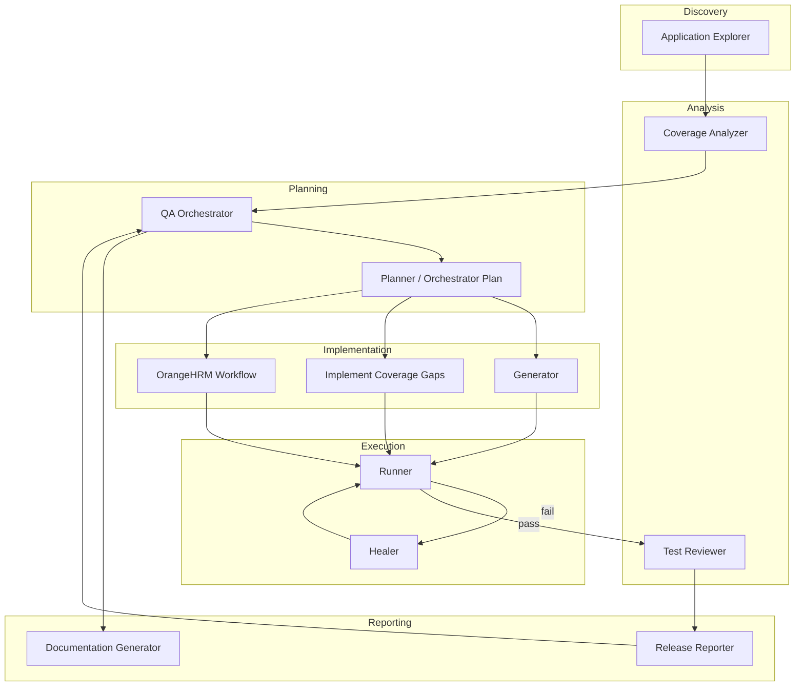
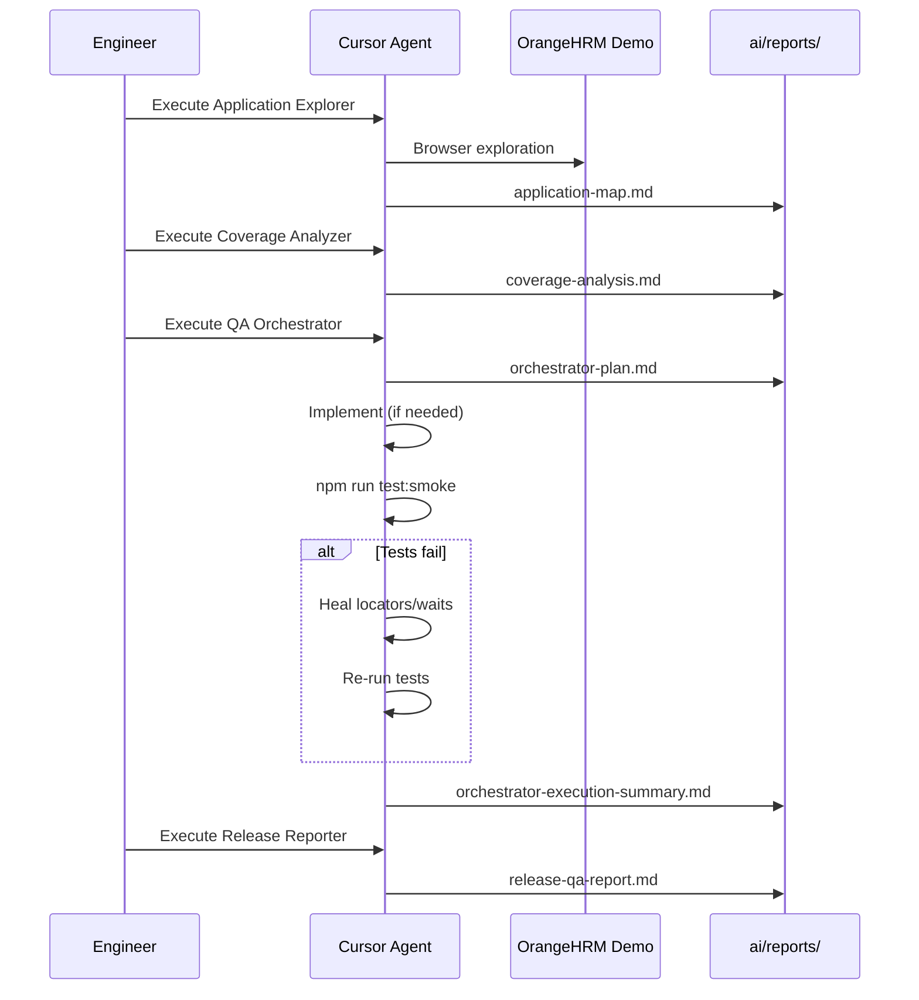
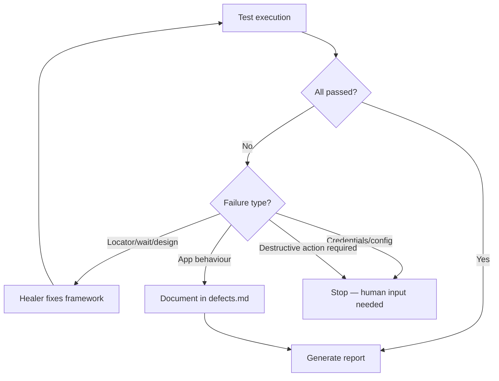
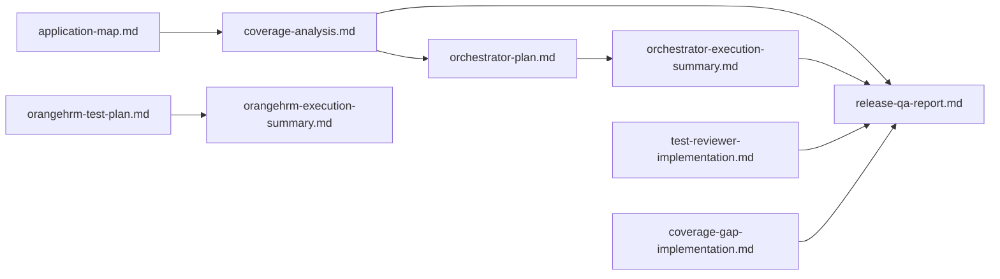

# AI Workflow

Catalogue of AI agents in the Autonomous QA Framework — purpose, inputs, outputs, decision logic, and failure handling.

**Related documents:** [README.md](README.md) · [ARCHITECTURE.md](ARCHITECTURE.md) · [ai/prompts/](ai/prompts/)

---

## Agent Overview



---

## End-to-End QA Cycle



---

## Agent Catalogue

### Application Explorer

| Attribute | Detail |
|-----------|--------|
| **Prompt** | [`ai/prompts/application-explorer.md`](ai/prompts/application-explorer.md) |
| **Purpose** | Discover application structure before writing tests |
| **Inputs** | Live app (via browser/MCP), existing `pages/`, `tests/` |
| **Outputs** | `ai/reports/application-map.md`, `application-explore-raw.json` |
| **Modifies code?** | No |

**Tasks:**
1. Login via existing helper
2. Visit every side-nav item
3. Record URLs, headings, tables, forms, buttons
4. Compare against existing page objects and tests
5. Suggest priorities and candidate tests

**Decision making:** Prioritises modules with zero coverage and read-only landing pages.

**Failure handling:** If login fails, stops and reports credential/config issue. Does not modify code.

---

### Coverage Analyzer

| Attribute | Detail |
|-----------|--------|
| **Prompt** | [`ai/prompts/coverage-analyzer.md`](ai/prompts/coverage-analyzer.md) |
| **Purpose** | Identify test coverage gaps and recommend next tests |
| **Inputs** | `tests/`, `pages/`, `fixtures/`, `helpers/`, prior reports |
| **Outputs** | `ai/reports/coverage-analysis.md` |
| **Modifies code?** | No |

**Tasks:**
1. Inspect smoke tests and page objects
2. Map covered vs uncovered OrangeHRM areas
3. Classify gaps (High / Medium / Low)
4. Recommend next 5 tests
5. Suggest page objects and helpers needed

**Decision making:** Prioritises auth lifecycle, core HR modules, and read-only functional depth.

**Failure handling:** Analysis-only — no test execution. Incomplete inputs produce conservative gap estimates.

---

### Planner

| Attribute | Detail |
|-----------|--------|
| **Prompt** | Embedded in Orchestrator and initial workflow prompts |
| **Purpose** | Create structured execution plans before implementation |
| **Inputs** | Coverage analysis, application map, release report |
| **Outputs** | `orchestrator-plan.md`, `orangehrm-test-plan.md` |
| **Modifies code?** | No (planning phase only) |

**Decision making:** Chooses highest value-to-risk improvement. Options include new tests, flaky fixes, page object improvements, CI changes, or report-only refresh.

---

### Generator

| Attribute | Detail |
|-----------|--------|
| **Prompts** | [`autonomous-orangehrm-workflow.md`](ai/prompts/autonomous-orangehrm-workflow.md), [`implement-coverage-gaps.md`](ai/prompts/implement-coverage-gaps.md) |
| **Purpose** | Generate tests, page objects, and helpers from plans |
| **Inputs** | Test plans, coverage analysis, existing framework |
| **Outputs** | New/updated `tests/`, `pages/`, `helpers/`, implementation reports |
| **Modifies code?** | Yes |

**Rules enforced:**
- Page Object Model
- Reuse fixtures and auth setup
- Read-only, non-destructive
- Resilient locators, no fixed waits
- Business-readable test names
- `@smoke` tag for CI alignment

**Failure handling:** Delegates to Healer on test failure.

---

### Runner

| Attribute | Detail |
|-----------|--------|
| **Prompt** | Implicit in Generator, Orchestrator, and workflow prompts |
| **Purpose** | Execute Playwright tests and capture results |
| **Inputs** | Implemented test code |
| **Commands** | `npm run test:smoke`, `npm test` |
| **Outputs** | Terminal results, `playwright-report/`, `test-results/` |
| **Modifies code?** | No |

**Decision making:**
- Smoke changes → `npm run test:smoke`
- Wider framework changes → `npm test`

**Failure handling:** Triggers Healer loop. Does not pass with weakened assertions.

---

### Healer

| Attribute | Detail |
|-----------|--------|
| **Prompt** | Rules embedded in Orchestrator, Generator, and Cursor rules |
| **Purpose** | Diagnose and fix test failures without removing meaningful assertions |
| **Inputs** | Playwright error output, traces, screenshots |
| **Outputs** | Updated locators, waits, test design fixes |
| **Modifies code?** | Yes (test framework only) |

**Common heals in this project:**

| Failure | Root cause | Fix |
|---------|------------|-----|
| Strict mode violation | Ambiguous locator | `exact: true`, `.first()`, specific heading text |
| Logout breaks e2e | Shared `storageState` invalidated | Move logout to `chromium` project |
| Timeout on login | `networkidle` on SPA | `waitForURL` instead |
| PIM search empty | Wrong demo data | Centralise id in `test-data.helper.ts` |

**Failure handling:** If behaviour appears to be a genuine app bug, documents in `orangehrm-defects.md` instead of weakening tests.

---

### Reviewer

| Attribute | Detail |
|-----------|--------|
| **Prompt** | [`ai/prompts/test-reviewer.md`](ai/prompts/test-reviewer.md) |
| **Purpose** | Quality review of existing Playwright tests |
| **Inputs** | `tests/e2e/` |
| **Outputs** | Review summary (issues, recommendations, files to change) |
| **Modifies code?** | No until human approval |

**Checks:**
- Brittle locators
- Weak assertions
- Unnecessary waits
- Duplicated logic
- Missing page object methods
- Flaky test risks
- Navigation-only tests without business outcomes

**Implementation log:** [`ai/reports/test-reviewer-implementation.md`](ai/reports/test-reviewer-implementation.md)

---

### Release Reporter

| Attribute | Detail |
|-----------|--------|
| **Prompt** | [`ai/prompts/release-report.md`](ai/prompts/release-report.md) |
| **Purpose** | Produce release-quality GO/NO-GO QA report |
| **Inputs** | Test results, coverage analysis, implementation reports, `tests/` |
| **Outputs** | `ai/reports/release-qa-report.md` |
| **Modifies code?** | No |

**Report sections:**
- Executive summary
- Test scope and inventory
- Pass/fail results
- Defects found
- Coverage summary and risks
- Flaky test assessment
- Recommended next tests
- Release recommendation

---

### QA Orchestrator

| Attribute | Detail |
|-----------|--------|
| **Prompt** | [`ai/prompts/autonomous-qa-orchestrator.md`](ai/prompts/autonomous-qa-orchestrator.md) |
| **Purpose** | Coordinate the full QA cycle with minimal human input |
| **Inputs** | Application map, coverage analysis, release report, raw explore JSON, framework code |
| **Outputs** | `orchestrator-plan.md`, `orchestrator-execution-summary.md`, optional code changes |
| **Modifies code?** | When plan requires it |

**Workflow stages:**
1. Inspect framework state
2. Read latest reports
3. Identify highest-value improvement
4. Decide action type (tests, heals, reports, CI)
5. Create execution plan
6. Implement if needed
7. Run tests
8. Heal failures
9. Create execution summary

**Decision making:** Value-to-risk ratio. Prefers read-only coverage. Stops only for credentials, destructive actions, or production-risk decisions.

**Rules:**
- No Maintenance destructive workflows
- No employee data mutation
- Reuse existing patterns
- Do not remove assertions to pass

---

### Documentation Generator

| Attribute | Detail |
|-----------|--------|
| **Prompt** | [`ai/prompts/documentation-generator.md`](ai/prompts/documentation-generator.md) |
| **Purpose** | Transform project into professional GitHub documentation |
| **Inputs** | Entire repository structure |
| **Outputs** | README, ARCHITECTURE, AI-WORKFLOW, ROADMAP, CONTRIBUTING, CHANGELOG, `docs/` |
| **Modifies code?** | Documentation only |

---

## Agent Invocation

In Cursor, reference a prompt file directly:

```text
Read and execute ai/prompts/autonomous-qa-orchestrator.md
```

Or chain agents in sequence:

1. Application Explorer → map the app
2. Coverage Analyzer → find gaps
3. QA Orchestrator → plan, implement, run
4. Release Reporter → GO/NO-GO decision
5. Documentation Generator → update docs

---

## Failure Handling Summary



| Stop condition | Action |
|--------------|--------|
| Missing credentials | Configure `.env` or GitHub secrets |
| Destructive workflow needed | Escalate to human; do not automate |
| Production-risk decision | Document options; await approval |
| Genuine app defect | Log in `orangehrm-defects.md`; do not weaken test |

---

## Report Dependency Graph



---

## Future Agent Extensions

Planned agents documented in [ROADMAP.md](ROADMAP.md):

- **PR Reviewer** — automated pull request test quality checks
- **Impact Analysis** — map code changes to affected tests
- **Defect Triage** — classify and prioritise failures from CI
- **Self-healing** — automated locator repair from DOM snapshots
- **MCP Explorer** — browser exploration via Model Context Protocol
