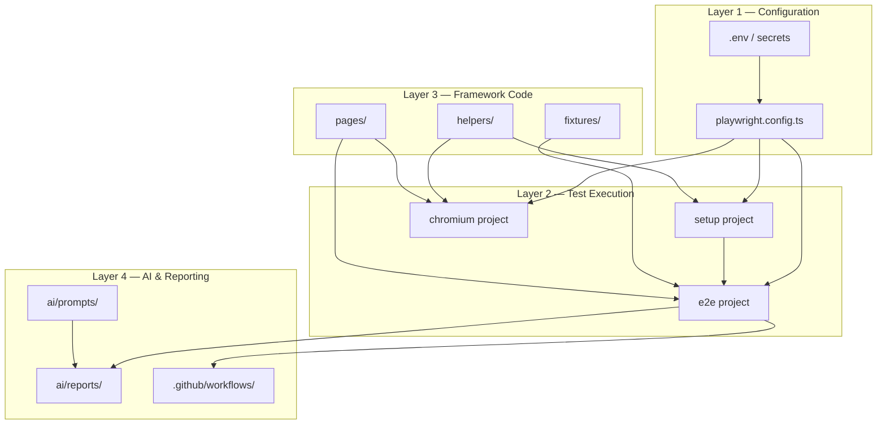
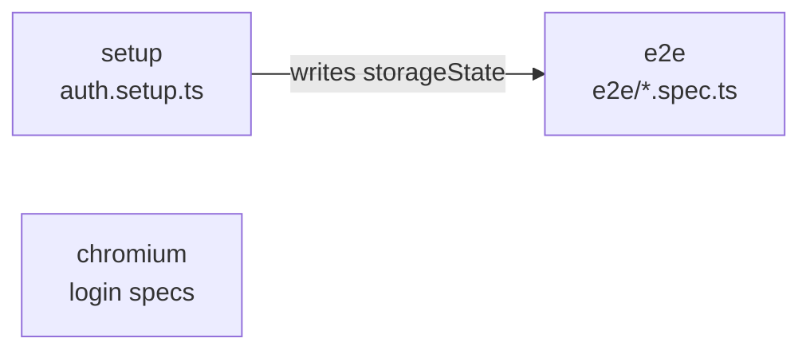
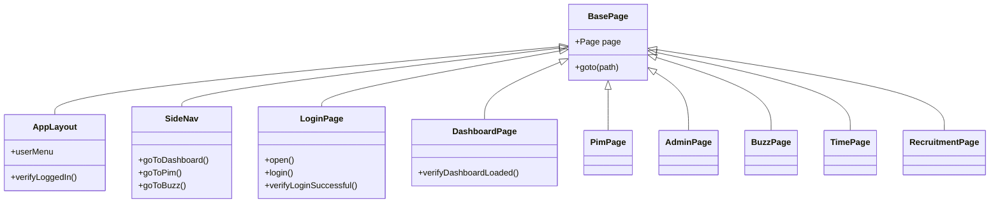
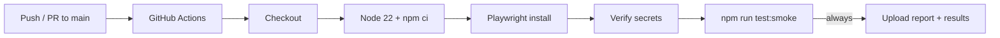
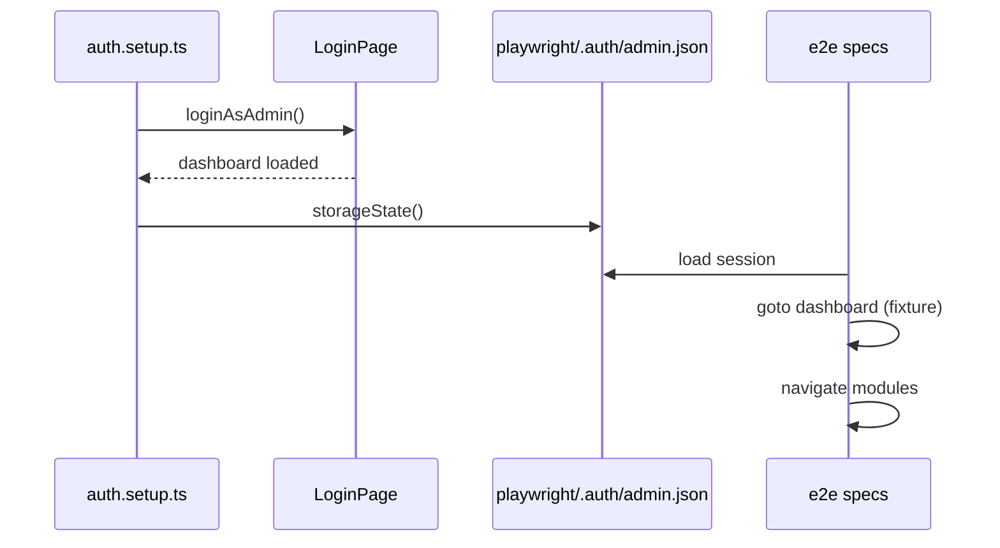
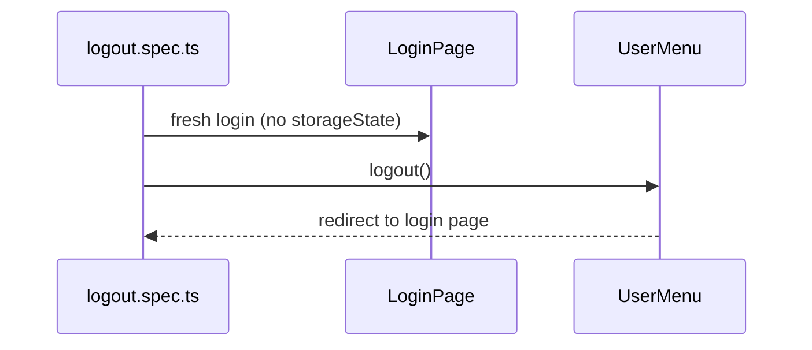

# Architecture

Technical architecture of the Autonomous QA Framework — a Playwright + TypeScript test automation stack with AI-orchestrated quality workflows.

**Related documents:** [README.md](README.md) · [AI-WORKFLOW.md](AI-WORKFLOW.md) · [docs/diagrams/](docs/diagrams/)

---

## Overview

The framework separates concerns into four layers:



---

## Framework Layers

### Configuration layer

| Component | Responsibility |
|-----------|----------------|
| `.env` | Runtime credentials and base URL (gitignored) |
| `.env.example` | Template for local setup |
| `playwright.config.ts` | Projects, timeouts, reporters, global `use` options |

Key config decisions:

- **`workers: 1`** — serial execution for shared OrangeHRM demo stability
- **`retries: 1`** — tolerate transient demo latency
- **`timeout: 60_000`** — generous timeout for slow public demo
- **`baseURL`** — from `BASE_URL` env var; tests use relative paths

### Test execution layer

Three Playwright projects form a dependency chain:



| Project | `testMatch` / `testIgnore` | `storageState` | Tests |
|---------|---------------------------|----------------|-------|
| `setup` | `auth.setup.ts` | None | Authenticate, save session |
| `chromium` | Ignores `e2e/`, setup, example | None | Login, logout, negative login |
| `e2e` | `e2e/*.spec.ts` | `playwright/.auth/admin.json` | Module smokes SMK-01–11 |

**Design decision:** Auth flows that mutate session state (logout) run in `chromium` without shared `storageState` to avoid invalidating e2e tests.

### Framework code layer

Reusable automation building blocks consumed by tests.

### AI and reporting layer

Prompt-defined agents produce structured markdown in `ai/reports/`. Reports inform the next agent cycle. See [AI-WORKFLOW.md](AI-WORKFLOW.md).

---

## Page Object Model

Every page object extends `BasePage` and encapsulates locators + verification methods.



### Page object inventory

| Page Object | Module / concern |
|-------------|------------------|
| `BasePage` | Shared `page` reference and navigation |
| `AppLayout` | Logged-in chrome (user menu) |
| `SideNav` | Side-panel navigation (8 of 12 links) |
| `LoginPage` | Login form and assertions |
| `UserMenu` | Dropdown and logout |
| `DashboardPage` | Dashboard widgets |
| `PimPage` | Employee list and search |
| `DirectoryPage` | Employee directory cards |
| `LeavePage` | Leave list |
| `AdminPage` | System users |
| `BuzzPage` | Social feed posts |
| `TimePage` | Timesheets pending action |
| `RecruitmentPage` | Candidates list |

### Locator strategy

1. Prefer `getByRole` with accessible names
2. Use `exact: true` when breadcrumb headings cause ambiguity
3. Use `.first()` when multiple matching elements are expected (e.g. Buzz post cards)
4. Avoid `networkidle` — use `waitForURL` for SPA navigation
5. Avoid long XPath chains

---

## Fixtures

`fixtures/authenticated.fixture.ts` extends Playwright's `test` with:

```typescript
authenticatedPage: Page  // navigates to dashboard, waits for URL
```

E2e specs import `{ test, expect }` from this fixture instead of `@playwright/test` directly. The page inherits `storageState` from the e2e project config — no login per test.

---

## Helpers

| Helper | File | Purpose |
|--------|------|---------|
| `requireAuthEnv()` | `auth.helper.ts` | Validates `LOGIN_USERNAME` and `PASSWORD` |
| `loginAsAdmin(page)` | `auth.helper.ts` | Full login flow via `LoginPage` |
| `AUTH_STORAGE_PATH` | `auth.helper.ts` | Path to saved session JSON |
| `PIM_SEARCH_EMPLOYEE_ID` | `test-data.helper.ts` | Stable demo employee id for read-only search |

`utils/` is reserved for future API clients — currently empty.

---

## Reports

AI agents and test runs produce artefacts in `ai/reports/`:

| Category | Examples |
|----------|----------|
| Exploration | `application-map.md`, `application-explore-raw.json` |
| Analysis | `coverage-analysis.md` |
| Planning | `orangehrm-test-plan.md`, `orchestrator-plan.md` |
| Execution | `orangehrm-execution-summary.md`, `orchestrator-execution-summary.md` |
| Quality | `release-qa-report.md`, `orangehrm-defects.md` |
| Implementation | `coverage-gap-implementation.md`, `test-reviewer-implementation.md` |

Reports cross-reference each other and form an audit trail for autonomous QA cycles.

---

## CI/CD



Workflow file: `.github/workflows/playwright-smoke.yml`

- Runs only `@smoke`-tagged tests (12 tests)
- Fails fast if secrets missing
- Uploads `playwright-report/` and `test-results/` on every run

---

## Authentication



**Logout flow (isolated):**



---

## AI Components

| Component | Location | Role |
|-----------|----------|------|
| Agent prompts | `ai/prompts/*.md` | Define agent behaviour, inputs, outputs |
| Cursor rules | `.cursor/rules/autonomous-qa-agent.mdc` | Global agent constraints in IDE |
| Generated reports | `ai/reports/` | Structured outputs from agent runs |
| Orchestrator | `autonomous-qa-orchestrator.md` | Coordinates full QA cycle |

Agents do not execute at runtime — they are invoked by engineers (or Cursor agents) during development. See [AI-WORKFLOW.md](AI-WORKFLOW.md).

---

## Folder Responsibilities

| Path | Responsibility |
|------|----------------|
| `tests/` | Spec files only — minimal logic |
| `tests/e2e/` | Authenticated smoke scenarios |
| `pages/` | Locators, actions, verifications |
| `fixtures/` | Playwright fixture extensions |
| `helpers/` | Stateless utility functions |
| `utils/` | Future API clients |
| `ai/prompts/` | Agent definitions (source of truth) |
| `ai/reports/` | Agent outputs (generated) |
| `docs/` | Human-facing supplementary docs |
| `.github/workflows/` | CI definitions |
| `playwright/.auth/` | Session state (gitignored) |

---

## Design Decisions

| Decision | Rationale | Trade-off |
|----------|-----------|-----------|
| `storageState` setup project | Faster e2e; login once per run | Logout must be isolated |
| `workers: 1` | Demo site can't handle parallel load | Slower local runs |
| `@smoke` tag for CI | Fast feedback on PRs | Full suite not in CI |
| Read-only tests only | Safe on shared demo | No CRUD coverage |
| `LOGIN_USERNAME` not `USERNAME` | Windows env var conflict | Slightly non-standard name |
| Prompt-driven AI agents | Auditable, version-controlled | Requires human invocation |
| Markdown reports | Portable, diffable in PRs | Not machine-queryable yet |
| Chromium only | Simpler CI | No cross-browser signal |

---

## Extension Points

1. **New module smoke** — add `pages/XPage.ts`, extend `SideNav`, add `tests/e2e/x.smoke.spec.ts` with `@smoke`
2. **New helper** — add to `helpers/` for shared test data or API calls
3. **New agent** — add prompt to `ai/prompts/`, document in [AI-WORKFLOW.md](AI-WORKFLOW.md)
4. **API layer** — implement clients in `utils/`, add `api/` test project in config
5. **Multi-browser** — duplicate project blocks in `playwright.config.ts`

See [CONTRIBUTING.md](CONTRIBUTING.md) for step-by-step instructions.
