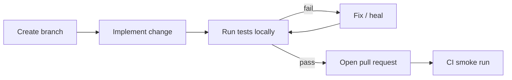

# Contributing

Thank you for your interest in contributing to the Autonomous QA Framework. This guide covers setup, conventions, and how to extend tests, page objects, prompts, and agents.

**Related documents:** [README.md](README.md) · [ARCHITECTURE.md](ARCHITECTURE.md) · [AI-WORKFLOW.md](AI-WORKFLOW.md)

---

## Getting Started

### Clone

```bash
git clone https://github.com/YOUR_USERNAME/autonomous-qa-framework.git
cd autonomous-qa-framework
```

### Install

```bash
npm install
npx playwright install
cp .env.example .env
```

### Configure

Edit `.env`:

```env
BASE_URL=https://opensource-demo.orangehrmlive.com
LOGIN_USERNAME=Admin
PASSWORD=admin123
```

> Use `LOGIN_USERNAME`, not `USERNAME` — `USERNAME` is reserved on Windows.

### Verify setup

```bash
npm run test:smoke
```

Expected: **12/12 passed**.

---

## Development Workflow



1. Create a feature branch from `main`
2. Make changes following conventions below
3. Run `npm run test:smoke` (minimum) or `npm test` (full suite)
4. Open a PR — CI runs smoke tests automatically

---

## Creating Tests

### E2e smoke test (authenticated)

1. Create or extend a page object in `pages/`
2. Add navigation method to `SideNav` if needed
3. Create spec in `tests/e2e/`:

```typescript
import { test } from '../../fixtures/authenticated.fixture';
import { SideNav } from '../../pages/SideNav';
import { MyPage } from '../../pages/MyPage';

test.describe('OrangeHRM Smoke @smoke', () => {
  test('SMK-XX Admin can access My Module', async ({ authenticatedPage }) => {
    const sideNav = new SideNav(authenticatedPage);
    const myPage = new MyPage(authenticatedPage);

    await sideNav.goToMyModule();
    await myPage.verifyModuleLoaded();
  });
});
```

4. Tag with `@smoke` in describe or test title for CI inclusion

### Auth test (no shared session)

Place in `tests/` root (not `e2e/`). Runs in `chromium` project without `storageState`.

Examples: `login.spec.ts`, `logout.spec.ts`, `login-negative.spec.ts`

### Test naming

- Format: `SMK-XX <Business-readable scenario>`
- Use sequential SMK IDs
- Describe user outcome, not implementation

### Safety rules

- Read-only navigation and assertions on shared demo
- No create, edit, or delete employee data
- Do not access Maintenance destructive workflows
- No `page.waitForTimeout()` — use `waitForURL`, `expect`, or locator waits

---

## Creating Page Objects

1. Extend `BasePage` in `pages/MyPage.ts`
2. Compose `AppLayout` for logged-in checks
3. Define locators as class properties
4. Add `verify*Loaded()` methods with meaningful assertions

```typescript
import { expect, Page } from '@playwright/test';
import { BasePage } from './BasePage';
import { AppLayout } from './AppLayout';

export class MyPage extends BasePage {
  private layout: AppLayout;

  pageHeading = this.page.getByRole('heading', { name: 'My Module' });

  constructor(page: Page) {
    super(page);
    this.layout = new AppLayout(page);
  }

  async verifyModuleLoaded() {
    await expect(this.page).toHaveURL(/my-module/);
    await this.layout.verifyLoggedIn();
    await expect(this.pageHeading).toBeVisible();
  }
}
```

### Locator guidelines

| Prefer | Avoid |
|--------|-------|
| `getByRole('button', { name: 'Search' })` | Long CSS chains |
| `getByLabel('Username')` | XPath |
| `getByText('Records Found')` | `networkidle` |
| `.first()` when multiple expected | Index-based selectors |

---

## Creating Prompts

New AI agents live in `ai/prompts/`.

### Prompt template

```markdown
# Agent Name

Act as [role].

## Goal
[One sentence purpose]

## Inputs
- [files/directories]

## Tasks
1. [numbered steps]

## Rules
- [constraints]

## Output
Create report at: `ai/reports/my-report.md`

## Do not
- [exclusions]
```

### After creating a prompt

1. Document the agent in [AI-WORKFLOW.md](AI-WORKFLOW.md)
2. Add a row to the AI Prompts table in [README.md](README.md)
3. Test by executing in Cursor: *"Read and execute ai/prompts/my-agent.md"*

---

## Adding Agents

An "agent" is a prompt + expected outputs + optional Cursor rule.

| Step | Action |
|------|--------|
| 1 | Write prompt in `ai/prompts/` |
| 2 | Define inputs and output report path |
| 3 | Add failure handling rules (heal vs defect vs stop) |
| 4 | Document in `AI-WORKFLOW.md` |
| 5 | Run once and commit generated report as example |

For orchestrated agents, consider whether the QA Orchestrator should invoke your agent in its decision tree.

---

## Extending Helpers and Fixtures

### Helpers (`helpers/`)

Stateless functions shared across tests and setup:

- Auth utilities → `auth.helper.ts`
- Stable demo data → `test-data.helper.ts`
- Future API clients → `utils/`

### Fixtures (`fixtures/`)

Playwright fixture extensions. Import `{ test, expect }` from fixtures in e2e specs:

```typescript
import { test, expect } from '../../fixtures/authenticated.fixture';
```

---

## Running CI Locally

Simulate the GitHub Actions smoke run:

```bash
# Ensure env vars are set (same as .env)
npm ci
npx playwright install --with-deps
npm run test:smoke
```

Workflow file: `.github/workflows/playwright-smoke.yml`

---

## Submitting Pull Requests

### PR checklist

- [ ] Tests pass locally (`npm run test:smoke` minimum)
- [ ] New smoke tests tagged `@smoke`
- [ ] Page objects follow existing patterns
- [ ] No secrets committed (`.env` is gitignored)
- [ ] Read-only safety rules respected
- [ ] AI prompts documented in `AI-WORKFLOW.md` if added
- [ ] Reports updated in `ai/reports/` if agent-generated

### PR title format

```text
feat: add SMK-12 Performance module smoke
fix: heal Buzz post card strict mode locator
docs: refresh coverage analysis
chore: update orchestrator execution summary
```

### What we review

- Locator resilience
- Assertion meaningfulness
- POM adherence
- CI compatibility
- Safety constraints

---

## Code Style

- TypeScript strict patterns
- ESLint and Prettier configured in `package.json` devDependencies
- Match naming and structure of neighbouring files
- Minimal comments — code should be self-explanatory

---

## Questions?

Open a GitHub issue with:

- What you're trying to do
- Error output or trace path
- Which agent or test is involved

For architecture questions, see [ARCHITECTURE.md](ARCHITECTURE.md).
