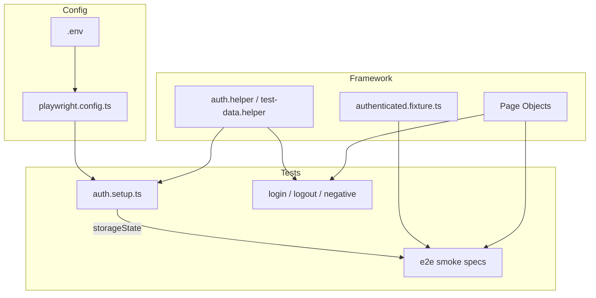
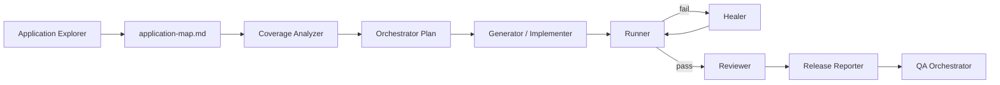

# Autonomous QA Framework

[](https://github.com/YOUR_USERNAME/autonomous-qa-framework/actions/workflows/playwright-smoke.yml)

An AI-orchestrated QA automation framework built with **Playwright**, **TypeScript**, **Cursor AI**, and **GitHub Actions**. It demonstrates how modern QA workflows move beyond traditional test scripting into **agentic, AI-assisted quality engineering** — exploring applications, analysing coverage, generating tests, healing failures, reviewing quality, and producing release reports.

**Application under test:** [OrangeHRM Open Source Demo](https://opensource-demo.orangehrmlive.com)

---

## Table of Contents

- [Motivation](#motivation)
- [Why Autonomous QA](#why-autonomous-qa)
- [Features](#features)
- [Current Capabilities](#current-capabilities)
- [Technology Stack](#technology-stack)
- [Framework Architecture](#framework-architecture)
- [AI Workflow](#ai-workflow)
- [Folder Structure](#folder-structure)
- [Installation](#installation)
- [Configuration](#configuration)
- [Running Tests](#running-tests)
- [GitHub Actions](#github-actions)
- [Test Reports](#test-reports)
- [AI Prompts](#ai-prompts)
- [Current Metrics](#current-metrics)
- [Reports Generated](#reports-generated)
- [Engineering Practices](#engineering-practices)
- [Project Roadmap](#project-roadmap)
- [Skills Demonstrated](#skills-demonstrated)
- [Interview Talking Points](#interview-talking-points)
- [Documentation](#documentation)
- [Contributing](#contributing)
- [License](#license)

---

## Motivation

Traditional test automation excels at repeating known scenarios but struggles to keep pace with evolving applications. Manual QA is thorough but slow and expensive. This project bridges the gap by combining:

- **Deterministic automation** (Playwright + TypeScript + POM)
- **Structured AI agents** (prompt-driven workflows in Cursor)
- **Continuous integration** (GitHub Actions smoke pipeline)

The result is a reproducible, portfolio-ready framework that shows how AI augments — rather than replaces — skilled QA engineering.

---

## Why Autonomous QA

| Traditional QA | Autonomous QA (this project) |
|----------------|------------------------------|
| Manual test design from scratch | AI explores app and maps modules |
| Coverage gaps found late | Coverage analyzer identifies gaps early |
| Flaky tests fixed by trial-and-error | Healer agent diagnoses locator/wait issues |
| Release notes written manually | Release reporter synthesises test results |
| Siloed tools and documents | Orchestrator coordinates the full cycle |

AI agents in this framework are **prompt-defined, human-auditable, and version-controlled** — not black-box magic.

---

## Features

- Playwright + TypeScript end-to-end automation
- Page Object Model with 13 page objects
- Authentication via `storageState` (setup project pattern)
- Custom fixtures for pre-authenticated sessions
- Tagged smoke suite (`@smoke`) aligned with CI
- Serial execution tuned for shared demo environments
- HTML reports, traces, screenshots, and video on failure
- Eight specialised AI agent prompts + orchestrator
- Ten structured QA reports in `ai/reports/`
- GitHub Actions workflow with artifact upload

---

## Current Capabilities

### Test suite

| ID | Scenario | Module |
|----|----------|--------|
| SMK-01 | Dashboard displays core widgets | Dashboard |
| SMK-02 | PIM Employee List accessible | PIM |
| SMK-03 | Employee Directory accessible | Directory |
| SMK-04 | Leave List accessible | Leave |
| SMK-05 | Admin can logout | Auth |
| SMK-06 | Invalid credentials rejected | Auth |
| SMK-07 | Admin module accessible | Admin |
| SMK-08 | PIM employee search (read-only) | PIM |
| SMK-09 | Buzz feed accessible | Buzz |
| SMK-10 | Time timesheets accessible | Time |
| SMK-11 | Recruitment candidates list | Recruitment |

Plus: auth setup, positive login test (full suite only).

### Safety constraints

- Read-only navigation and assertions
- No employee create/edit/delete
- Maintenance module excluded (destructive workflows)

---

## Technology Stack

| Layer | Technology |
|-------|------------|
| Test runner | Playwright 1.61 |
| Language | TypeScript |
| Environment | dotenv |
| Linting / formatting | ESLint, Prettier |
| CI/CD | GitHub Actions |
| AI IDE | Cursor (agent prompts) |
| Target app | OrangeHRM OS 5.8 (demo) |

---

## Framework Architecture



See [ARCHITECTURE.md](ARCHITECTURE.md) for full design documentation and [docs/diagrams/](docs/diagrams/) for additional diagrams.

---

## AI Workflow



Full agent documentation: [AI-WORKFLOW.md](AI-WORKFLOW.md)

---

## Folder Structure

```text
autonomous-qa-framework/
├── .github/workflows/     # CI pipelines
├── .cursor/rules/         # Cursor agent rules
├── ai/
│   ├── prompts/           # AI agent prompt definitions
│   └── reports/           # Generated QA artefacts
├── docs/                  # Architecture & workflow diagrams
├── fixtures/              # Playwright test fixtures
├── helpers/               # Auth and test-data utilities
├── pages/                 # Page Object Model classes
├── tests/
│   ├── e2e/               # Authenticated smoke specs
│   ├── auth.setup.ts      # Session bootstrap
│   ├── login.spec.ts
│   ├── logout.spec.ts
│   └── login-negative.spec.ts
├── playwright.config.ts
├── package.json
└── README.md
```

---

## Installation

### Prerequisites

- Node.js 22+ (matches CI)
- npm 10+
- Git

### Steps

```bash
git clone https://github.com/YOUR_USERNAME/autonomous-qa-framework.git
cd autonomous-qa-framework
npm install
npx playwright install
cp .env.example .env
```

Edit `.env` with your credentials (see [Configuration](#configuration)).

---

## Configuration

### Environment variables

| Variable | Required | Description |
|----------|----------|-------------|
| `BASE_URL` | Yes | Application base URL |
| `LOGIN_USERNAME` | Yes | Admin username (`LOGIN_USERNAME`, not `USERNAME` — Windows reserved name) |
| `PASSWORD` | Yes | Admin password |

Example (`.env.example`):

```env
BASE_URL=https://opensource-demo.orangehrmlive.com
LOGIN_USERNAME=Admin
PASSWORD=admin123
```

### Playwright projects

| Project | Purpose | `storageState` |
|---------|---------|----------------|
| `setup` | Save authenticated session | No |
| `chromium` | Auth tests (login, logout, negative) | No |
| `e2e` | Module smoke tests | Yes (`playwright/.auth/admin.json`) |

---

## Running Tests

```bash
# Full suite (13 tests)
npm test

# Smoke suite only — matches CI (12 tests)
npm run test:smoke

# Headed browser (debugging)
npm run test:headed

# Playwright UI mode
npm run test:ui

# Open HTML report
npm run report
```

---

## GitHub Actions

Workflow: [`.github/workflows/playwright-smoke.yml`](.github/workflows/playwright-smoke.yml)

**Triggers:** push/PR to `main`, manual `workflow_dispatch`

**Steps:** checkout → Node 22 → `npm ci` → Playwright browsers → env verification → `npm run test:smoke` → upload HTML report and test-results artifacts

**Required GitHub secrets:**

| Secret | Value |
|--------|-------|
| `BASE_URL` | OrangeHRM demo URL |
| `LOGIN_USERNAME` | `Admin` |
| `PASSWORD` | `admin123` (or your credentials) |

---

## Test Reports

Playwright generates an HTML report at `playwright-report/` after each run.

On failure, artefacts include:

- Screenshots (`screenshot: only-on-failure`)
- Video (`video: retain-on-failure`)
- Trace (`trace: on-first-retry`)

CI uploads `playwright-report/` and `test-results/` as workflow artifacts.

---

## AI Prompts

| Prompt | Agent role | Output |
|--------|------------|--------|
| [`application-explorer.md`](ai/prompts/application-explorer.md) | Application Explorer | `application-map.md` |
| [`coverage-analyzer.md`](ai/prompts/coverage-analyzer.md) | Coverage Analyzer | `coverage-analysis.md` |
| [`autonomous-orangehrm-workflow.md`](ai/prompts/autonomous-orangehrm-workflow.md) | Generator | Tests + test plan |
| [`implement-coverage-gaps.md`](ai/prompts/implement-coverage-gaps.md) | Generator | SMK-04–08 implementation |
| [`test-reviewer.md`](ai/prompts/test-reviewer.md) | Reviewer | Review recommendations |
| [`release-report.md`](ai/prompts/release-report.md) | Release Reporter | `release-qa-report.md` |
| [`autonomous-qa-orchestrator.md`](ai/prompts/autonomous-qa-orchestrator.md) | QA Orchestrator | Plan + execution summary |
| [`documentation-generator.md`](ai/prompts/documentation-generator.md) | Technical Writer | Project documentation |

**Usage:** Open a prompt in Cursor and ask the agent to execute it, e.g. *"Read and execute `ai/prompts/autonomous-qa-orchestrator.md`"*.

---

## Current Metrics

| Metric | Value |
|--------|-------|
| Smoke tests (`@smoke`) | 12 |
| Full suite tests | 13 |
| Page objects | 13 |
| Module coverage | **75%** (9 / 12 OrangeHRM modules) |
| Latest smoke result | **12/12 passed** |
| Latest full suite | **13/13 passed** |
| Open defects | 0 |
| Release status | **GO** (smoke-level) |

---

## Current Coverage

### Covered modules (9)

Dashboard · PIM · Directory · Leave · Admin · Buzz · Time · Recruitment · Auth lifecycle

### Uncovered modules (4)

My Info · Performance · Maintenance (intentionally excluded from smoke) · Claim

Details: [`ai/reports/coverage-analysis.md`](ai/reports/coverage-analysis.md)

---

## Reports Generated

| Report | Purpose |
|--------|---------|
| [`application-map.md`](ai/reports/application-map.md) | Site map and module inventory |
| [`coverage-analysis.md`](ai/reports/coverage-analysis.md) | Gap analysis and recommendations |
| [`release-qa-report.md`](ai/reports/release-qa-report.md) | Release GO/NO-GO decision |
| [`orchestrator-plan.md`](ai/reports/orchestrator-plan.md) | Orchestrator execution plan |
| [`orchestrator-execution-summary.md`](ai/reports/orchestrator-execution-summary.md) | Orchestrator run results |
| [`orangehrm-test-plan.md`](ai/reports/orangehrm-test-plan.md) | Initial smoke test plan |
| [`orangehrm-execution-summary.md`](ai/reports/orangehrm-execution-summary.md) | Initial workflow summary |
| [`coverage-gap-implementation.md`](ai/reports/coverage-gap-implementation.md) | SMK-04–08 implementation log |
| [`test-reviewer-implementation.md`](ai/reports/test-reviewer-implementation.md) | Reviewer recommendations applied |
| [`orangehrm-defects.md`](ai/reports/orangehrm-defects.md) | Defect log |

---

## Engineering Practices

- **Page Object Model** — locators and assertions encapsulated in `pages/`
- **Resilient locators** — `getByRole`, labels, semantic headings over brittle CSS
- **No `networkidle`** — OrangeHRM SPA incompatible; use `waitForURL`
- **Serial execution** — `workers: 1` for shared demo stability
- **Session isolation** — logout runs in `chromium` project without shared `storageState`
- **Read-only safety** — no data mutation on shared demo
- **Tagged CI scope** — `@smoke` tag gates the pipeline
- **Prompt-as-code** — AI workflows version-controlled in `ai/prompts/`

---

## Project Roadmap

See [ROADMAP.md](ROADMAP.md) for near-, medium-, and long-term goals including API testing, accessibility, visual regression, self-healing, MCP integration, and RAG.

**Near-term highlights:**

- SMK-12 Performance module smoke
- Directory search/filter depth
- Claim module coverage

---

## Skills Demonstrated

- Playwright test architecture (projects, fixtures, storage state)
- TypeScript automation engineering
- Page Object Model design
- CI/CD pipeline configuration
- AI-assisted test generation and review
- Coverage analysis and release reporting
- Flaky test diagnosis and locator healing
- Technical documentation for open-source portfolios

---

## Interview Talking Points

1. **Why `storageState`?** — Authenticate once in setup; e2e tests skip login overhead and reduce flakiness.
2. **Why logout is not in e2e?** — Logout invalidates the shared session; isolated to `chromium` project.
3. **How do AI agents fit?** — Each agent has a bounded prompt, defined inputs/outputs, and produces auditable markdown reports.
4. **How do you handle demo flakiness?** — Serial workers, 60s timeout, 1 retry, no `networkidle`, resilient locators.
5. **What's the coverage strategy?** — Read-only module smokes first (75%), then functional depth (search, pagination), then role-based tests.
6. **GO vs full regression?** — Release report explicitly scopes smoke-level confidence with documented risks.

---

## Documentation

| Document | Description |
|----------|-------------|
| [ARCHITECTURE.md](ARCHITECTURE.md) | Framework layers, design decisions, diagrams |
| [AI-WORKFLOW.md](AI-WORKFLOW.md) | AI agent catalogue and workflows |
| [ROADMAP.md](ROADMAP.md) | Future work organised by horizon |
| [CONTRIBUTING.md](CONTRIBUTING.md) | How to contribute |
| [CHANGELOG.md](CHANGELOG.md) | Version history |
| [docs/](docs/) | Supplementary diagrams and image placeholders |

---

## Contributing

Contributions are welcome. See [CONTRIBUTING.md](CONTRIBUTING.md) for setup, conventions, and PR guidelines.

---

## License

[ISC](LICENSE) — see `package.json`.

---

## Future Work

- Performance and Claim module smokes
- API test layer in `utils/`
- Accessibility audits (`@axe-core/playwright`)
- Visual regression baselines
- Multi-browser matrix in CI
- MCP-connected application explorer
- Self-healing locator pipeline

Full roadmap: [ROADMAP.md](ROADMAP.md)
