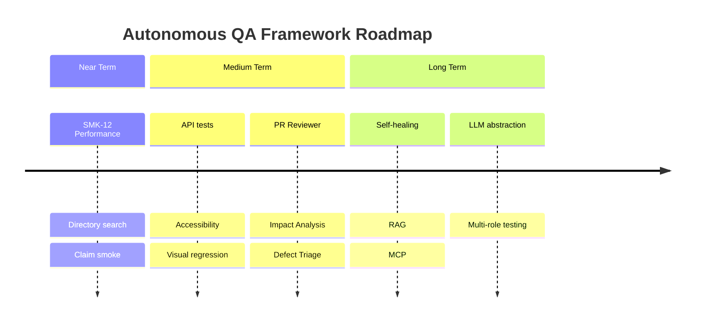

# Roadmap

Future work for the Autonomous QA Framework, organised by time horizon.

**Related documents:** [README.md](README.md) · [ai/reports/coverage-analysis.md](ai/reports/coverage-analysis.md) · [ai/reports/release-qa-report.md](ai/reports/release-qa-report.md)

---

## Current Baseline (v1.0)

| Metric | Status |
|--------|--------|
| Smoke tests | 12 (`@smoke`) |
| Full suite | 13 |
| Module coverage | 75% (9 / 12) |
| CI | GitHub Actions smoke pipeline |
| AI agents | 8 prompts + orchestrator |
| Release status | GO (smoke-level) |

---

## Near Term (0–3 months)

### Test coverage

| Item | Priority | Description |
|------|----------|-------------|
| SMK-12 Performance module | High | Read-only landing smoke for Manage Reviews |
| Directory search/filter | High | Extend SMK-03 with name filter assertion |
| SMK-13 Claim module | Medium | Read-only assign-claim list smoke |
| PIM pagination | Medium | Navigate to page 2; verify row change |
| README badge URL | Low | Replace `YOUR_USERNAME` placeholder after publish |

### Framework quality

| Item | Priority | Description |
|------|----------|-------------|
| `LoginPage.verifyLoginFailed()` | Medium | Consolidate negative login assertions |
| User menu coverage | Medium | Assert Profile and Support menu items |
| Remove scaffold files | Low | Delete `tests/example.spec.ts` if present |
| LICENSE file | Low | Add explicit ISC LICENSE file to repo root |

### Documentation

| Item | Priority | Description |
|------|----------|-------------|
| Real screenshots | Medium | Replace placeholders in `docs/images/` |
| Demo GIF | Low | Record smoke run for README |

---

## Medium Term (3–6 months)

### API testing

- Implement REST clients in `utils/`
- Add Playwright `request` fixture or separate API test project
- Cover OrangeHRM auth token and read-only GET endpoints
- Cross-validate UI state against API responses

### Visual testing

- Integrate Playwright visual comparisons or Percy/Applitools
- Baseline screenshots for Dashboard, PIM, Directory
- CI gate on visual diff threshold

### Accessibility

- Add `@axe-core/playwright`
- Smoke-level a11y scan on login, dashboard, PIM
- Report violations in `ai/reports/a11y-audit.md`

### Multi-browser CI

- Extend `playwright.config.ts` with Firefox and WebKit projects
- Nightly matrix workflow (smoke on all browsers)
- Keep PR CI on Chromium for speed

### PR Reviewer agent

- New prompt: analyse PR diff for test impact
- Check: new code has tests, locators follow conventions, `@smoke` tag correct
- Output: `ai/reports/pr-review.md`

### Impact Analysis agent

- Map changed files → affected specs
- Recommend minimal test subset for PR validation
- Output: suggested `playwright test` command

### Defect Triage agent

- Ingest CI failure artefacts (trace, screenshot, log)
- Classify: flaky / locator / app bug / env
- Output: `ai/reports/defect-triage.md` with severity

---

## Long Term (6–12 months)

### Self-healing

- DOM snapshot on locator failure
- LLM suggests alternative locators (role, label, text)
- Human approval gate before auto-commit
- Metrics: heal success rate, false positive rate

### RAG integration

- Index `ai/reports/`, page objects, and test history in vector store
- Agents retrieve relevant context for exploration and healing
- Reduce token usage and improve consistency across runs

### MCP integration

- Connect Application Explorer to Playwright MCP server
- Live browser control from Cursor without manual steps
- Structured exploration output directly to `application-explore-raw.json`

### LLM abstraction

- Provider-agnostic agent runner (OpenAI, Anthropic, local models)
- Prompt templates with variable injection
- Agent execution logging and cost tracking

### Role-based testing

- Employee credentials for My Info module
- Admin vs employee permission boundaries
- Separate `storageState` per role

### Maintenance module strategy

- Document read-only access patterns if demo allows
- Explicit exclusion policy for destructive purge workflows

---

## Roadmap Diagram

---

## Coverage Target Progression

| Milestone | Module coverage | Key deliverable |
|-----------|-----------------|-----------------|
| v1.0 (current) | 75% | SMK-01–11, auth lifecycle |
| v1.1 | 83% | Performance + Claim smokes |
| v1.2 | 92% | My Info (employee creds) |
| v2.0 | 92%+ depth | Search, pagination, API cross-check |
| v3.0 | Full depth | Self-healing, RAG, MCP explorer |

> **Note:** Maintenance module may remain permanently excluded from smoke due to destructive workflows.

---

## How to Propose Roadmap Items

1. Open an issue describing the gap or feature
2. Reference coverage analysis or release report section
3. Estimate value-to-risk ratio
4. Submit PR with prompt definition if it's a new AI agent

See [CONTRIBUTING.md](CONTRIBUTING.md).
