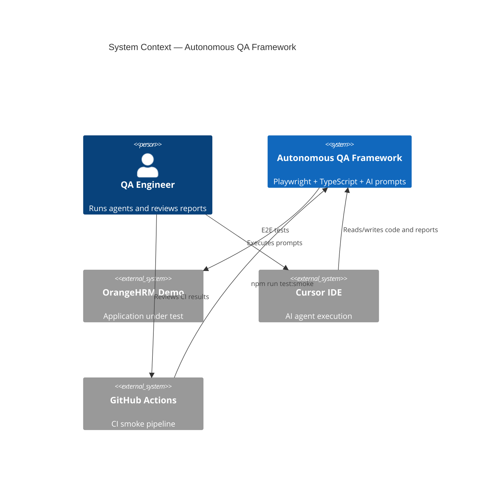
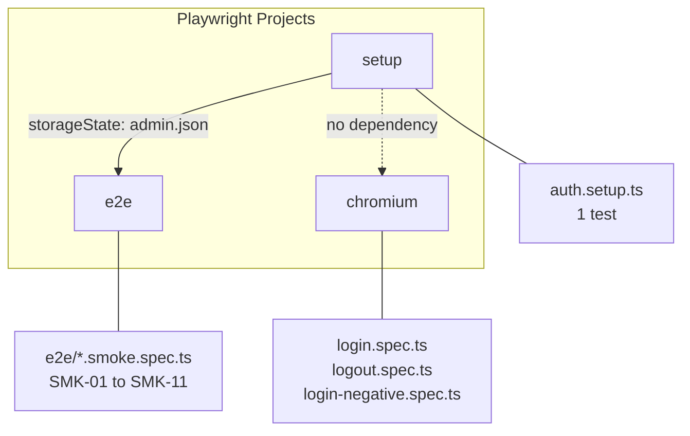
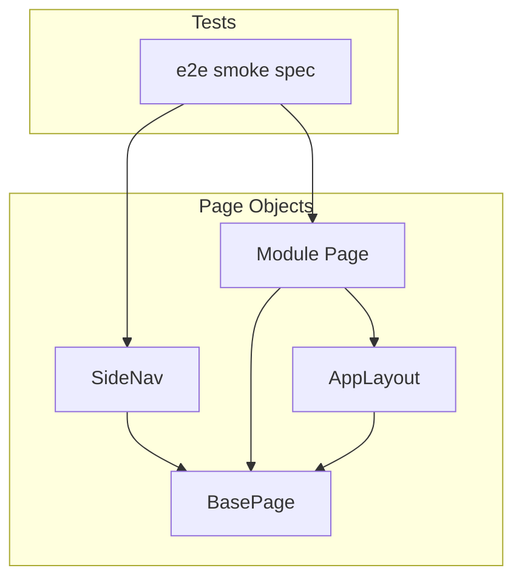
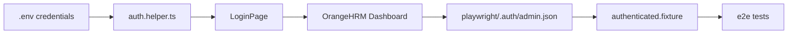
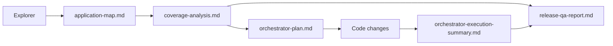
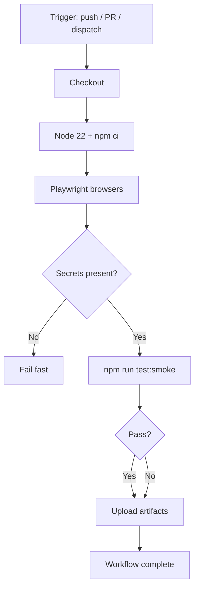
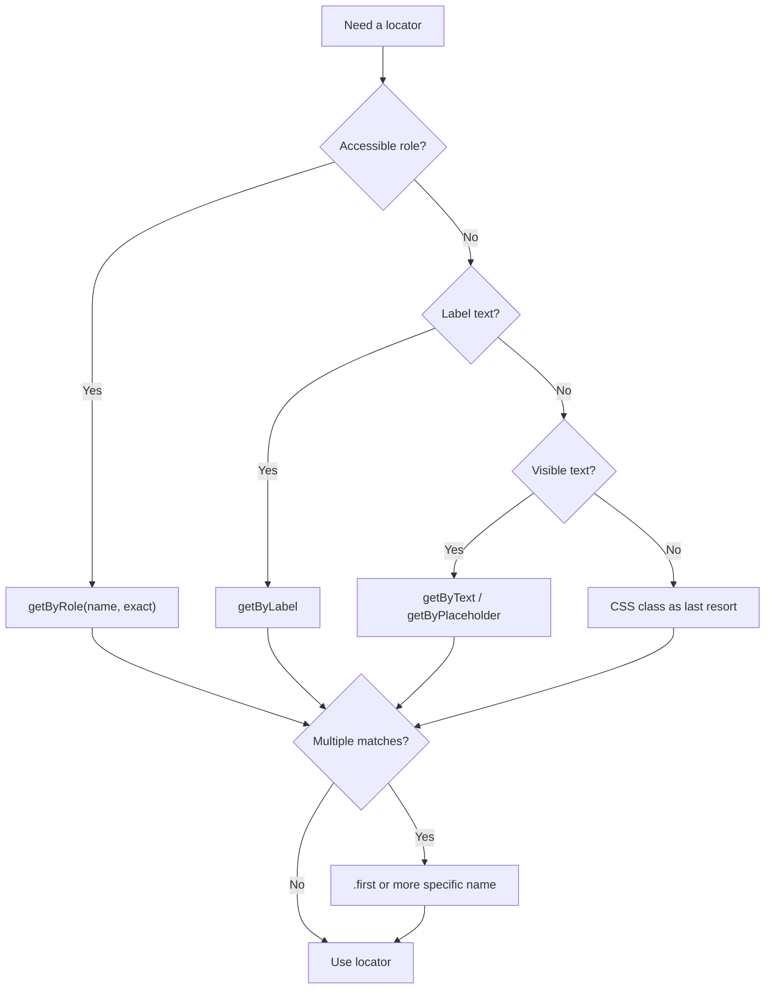

# Architecture Diagrams

Mermaid diagrams for the Autonomous QA Framework. These supplement [ARCHITECTURE.md](../../ARCHITECTURE.md).

---

## System Context

> Note: C4Context requires Mermaid 9+ / compatible renderer. Fallback: see layered diagram in [ARCHITECTURE.md](../../ARCHITECTURE.md).

---

## Test Project Dependency

---

## Page Object Composition

---

## Data Flow — Auth Setup

---

## Report Artefact Flow

---

## CI Pipeline

---

## Locator Strategy Decision Tree

---

Back to [docs index](../README.md) · [ARCHITECTURE.md](../../ARCHITECTURE.md)
