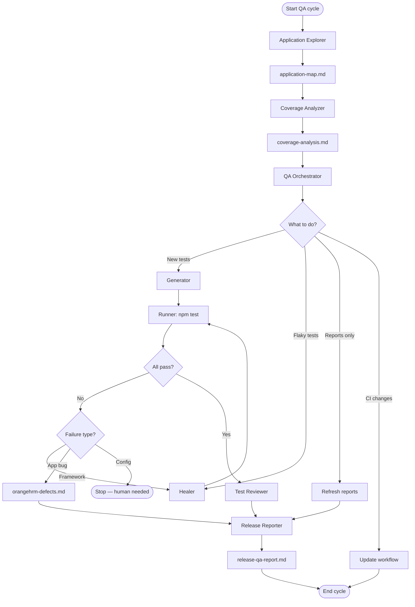
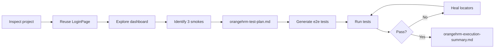
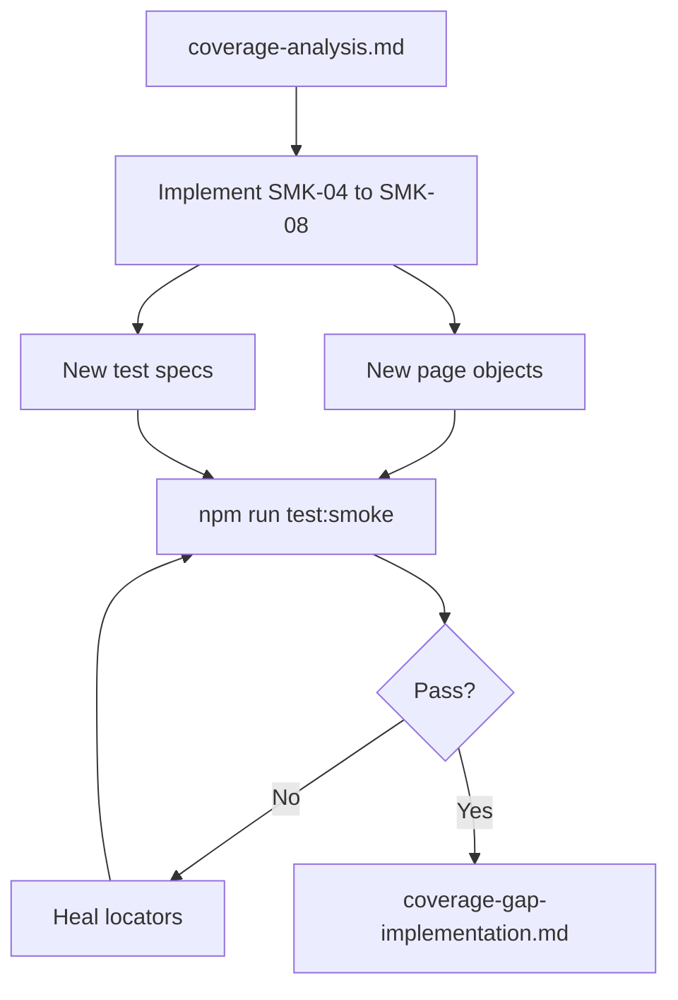
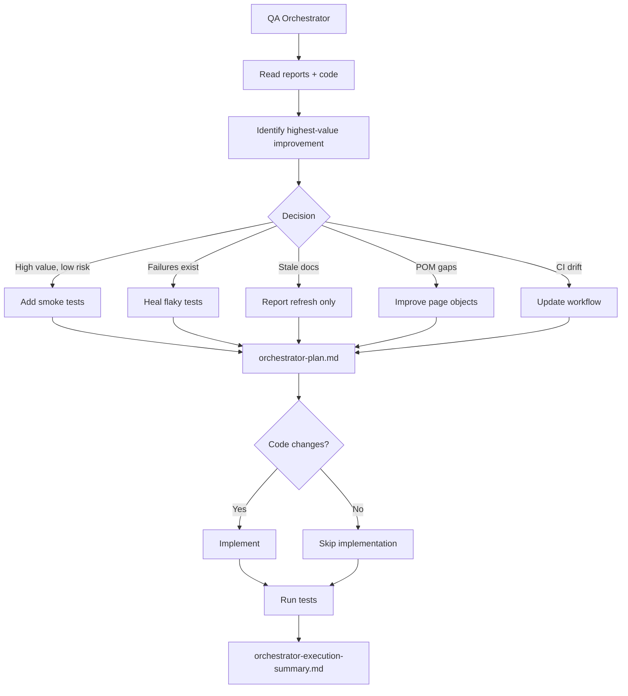
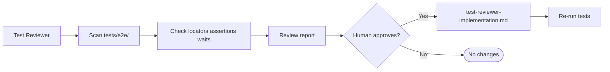
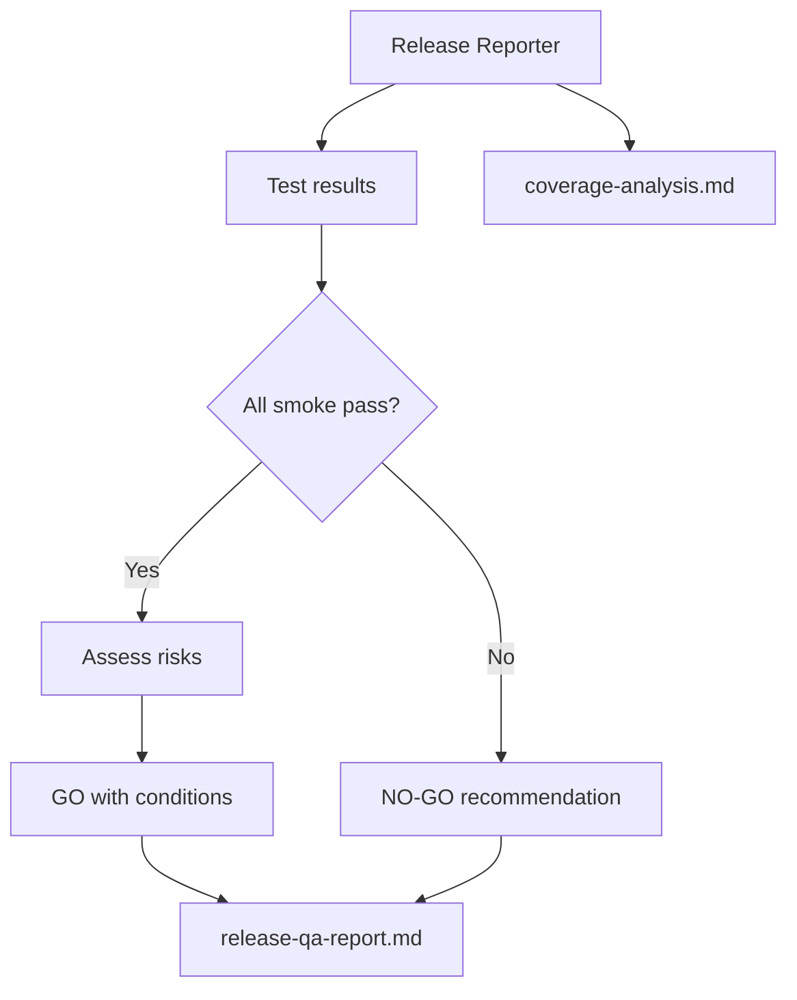
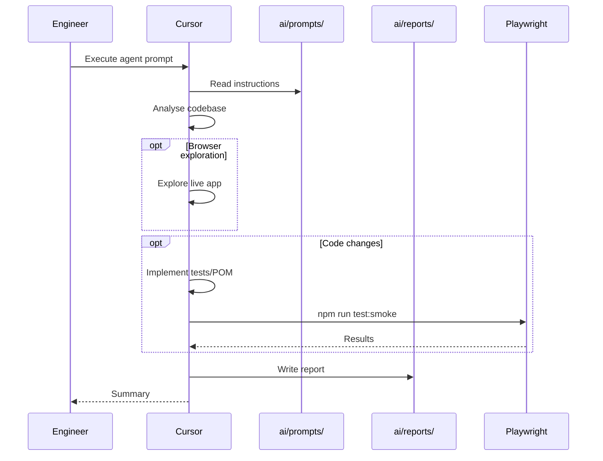

# Workflow Diagrams

AI agent and QA cycle workflow diagrams. These supplement [AI-WORKFLOW.md](../../AI-WORKFLOW.md).

---

## Full Autonomous QA Cycle

---

## OrangeHRM Initial Workflow

From [`autonomous-orangehrm-workflow.md`](../../ai/prompts/autonomous-orangehrm-workflow.md):

---

## Coverage Gap Implementation

From [`implement-coverage-gaps.md`](../../ai/prompts/implement-coverage-gaps.md):

---

## Orchestrator Decision Tree

---

## Test Reviewer Flow

---

## Release Decision Flow

---

## Agent Invocation Sequence

---

Back to [docs index](../README.md) · [AI-WORKFLOW.md](../../AI-WORKFLOW.md)
